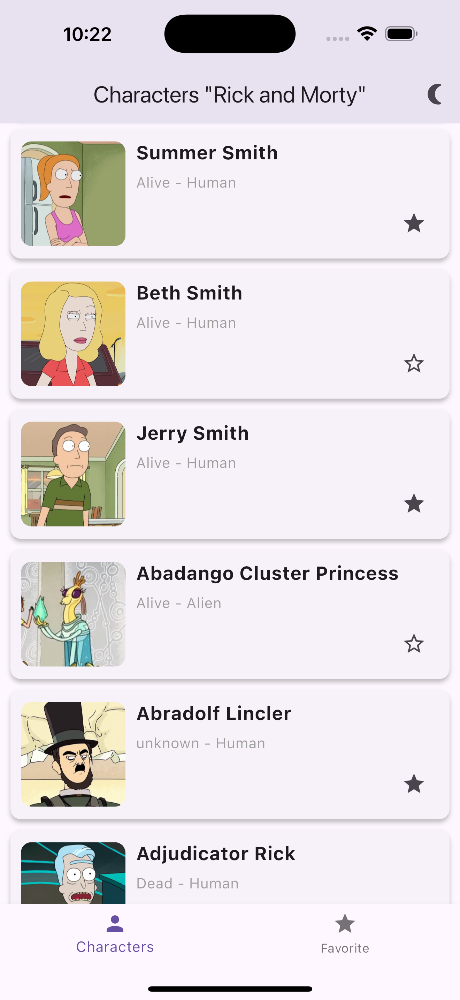
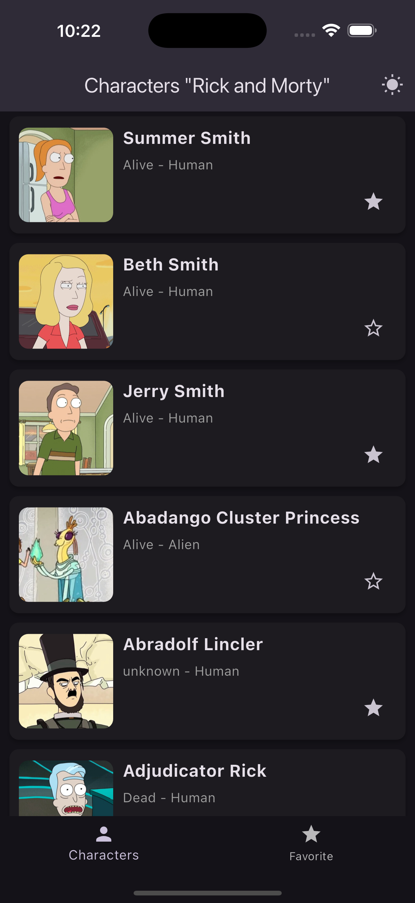
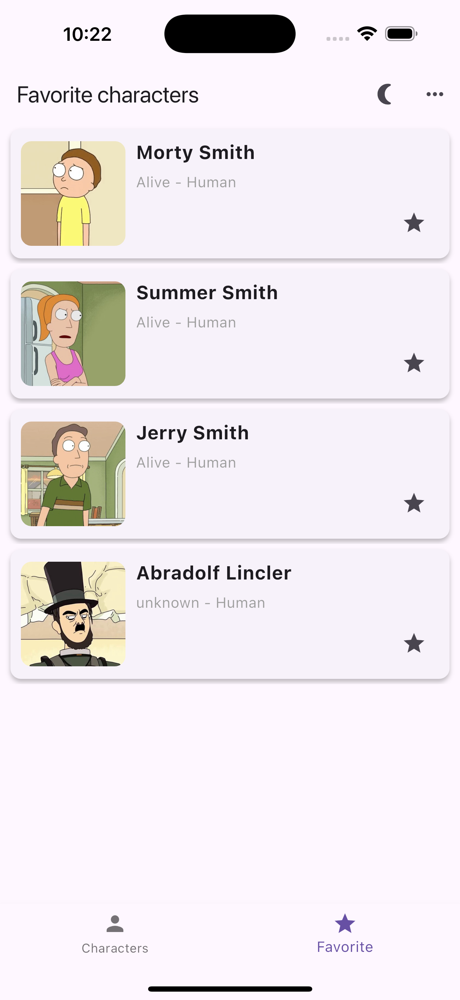
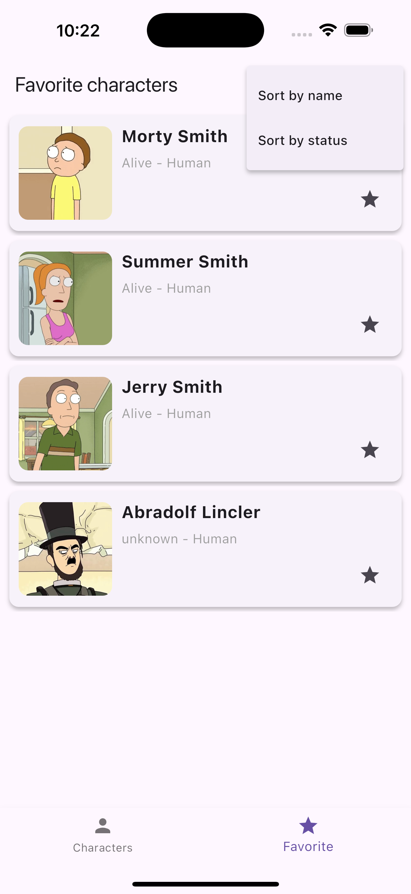
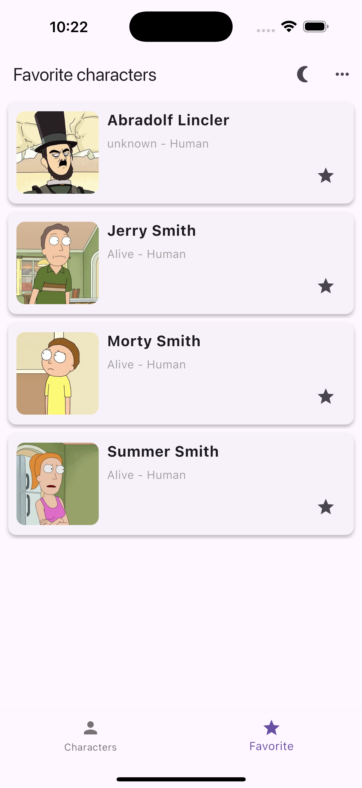
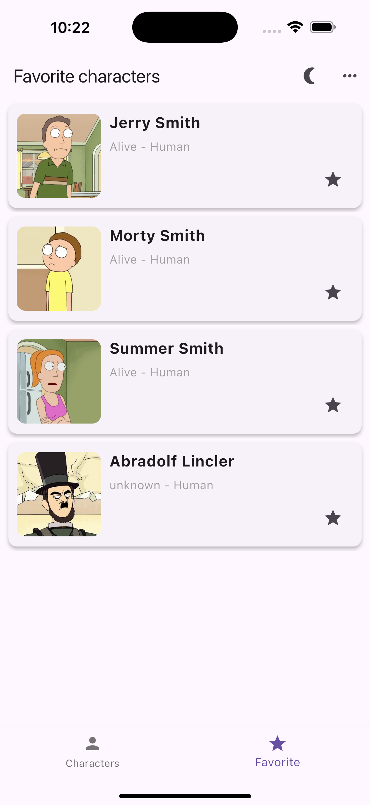

# Rick and Morty Characters List

This project is a simple Flutter app that displays a list of characters from the *Rick and Morty* TV show. The app supports infinite scrolling, stores characters locally using Hive, and fetches data from the Rick and Morty API.

## Features
- Displays a list of characters from the API
- Infinite scroll for loading more characters
- Caching data using Hive for offline access
- Clean and responsive UI with light and dark modes

## Screenshots

1. **Main screen with light theme and selected favorites**  
     
   *The app displays the main screen with light theme and marked favorite characters.*

2. **Main screen with dark theme**  
     
   *Dark theme for the main screen showing the list of characters.*

3. **Favorites screen showing selected characters**  
     
   *Here, you can see the screen showing the favorite characters.*

4. **Sorting functionality**  
     
   *Sorting options are available to organize the character list by name or status.*

5. **Sorting characters by name**  
     
   *Here you can see how the characters are sorted by name.*

6. **Sorting characters by status**  
     
   *In this screenshot, characters are sorted by their status (alive, dead, unknown).*

## Installation

To run the project locally, follow these steps:

1. Clone the repository:
   ```bash
   git clone https://github.com/wwwnnnnn04/list_of_characters.git

2. Install dependencies:
    flutter pub get

3. Run the app:
    flutter run

**Technologies Used**
- Flutter
- Hive (local storage)
- HTTP package for API requests
- Provider for state management